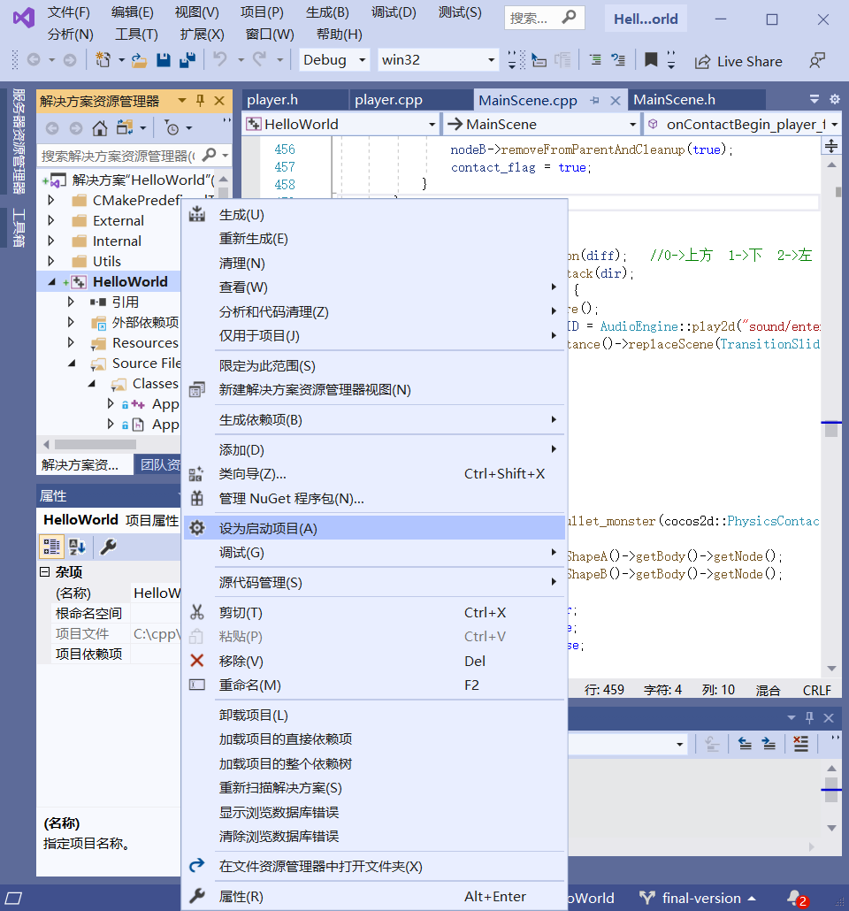
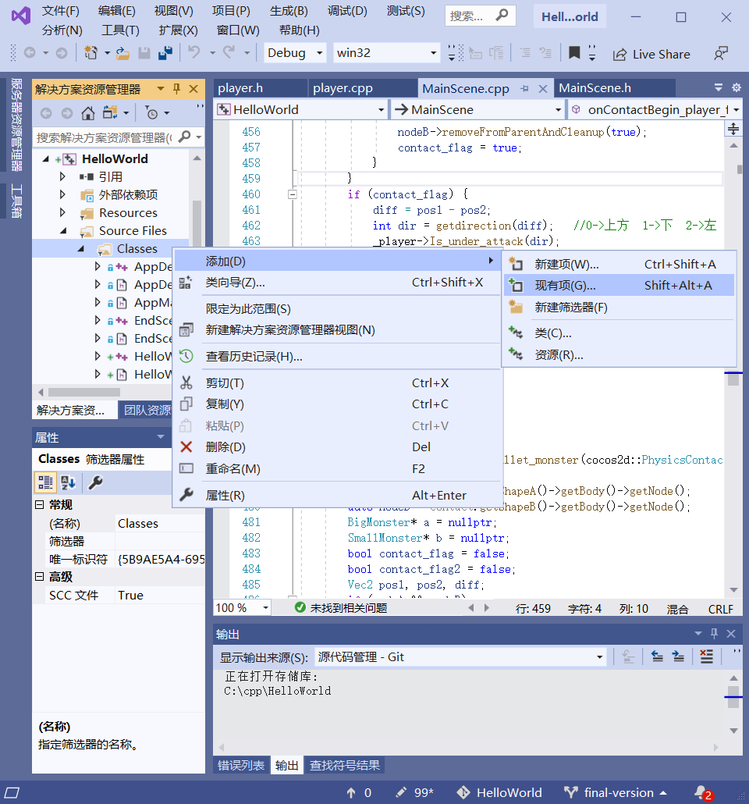

# Cpp_dev_final
A *BOXHEAD* game (also known as 《僵尸危机》 in Chinese) rebuilt with cocos2d-x-4.0 in C++.  
Final project of course "Design Method and Develop Environment of Software"  

## User Manual: How to play
Due to lack of artistic efforts, the user interface might not be fully coherent with the game. We apologize for that.  
#### (Re)start the game  
Press  to start a new game.  
#### Go back to title page
When the game ends, press  to go back to the title page.  
#### Move and fire
Use `W` `A` `S` `D` to move, and `J` to fire.
#### Choose weapons
Select your weapons with number keys above `WASD`.
`1` for pistol (weak but with infinite ammunition)  
`2` for Uzi (a type of micro sub-machine gun)  
`3` for shotgun (boasts high power)  
`4` for barrels (explode when you shoot them; also hurts yourself)  
It was quite a debate to set proper firepower for these weapons. Personally speaking, I think the fire rate of Uzi is too low, but that of shotgun goes too high.  
#### HP  
Your HP get recovered automatically but slowly as long as you do not get attacked.  
#### Score  
Your score increases, not immediately but gradually, as you kill zombies. Kill a grey one in level 1 and wait a while to understand the mechanism.  
#### Invinci Mode  
It was **too difficult** for me, as a really unskilled player, even to beat level 2. That's why I made an official cheat to fully test the game (With the cheat I did find and fix a bug in callback functions about physical effects). So just press `U` while playing, to become invincible with unlimited ammo. Press `U` again to exit Invinci Mode. Currently no visual hint is offered in the game for Invinci Mode.  

## Clone this repository
Follow [this link](https://help.github.com/en/github/authenticating-to-github/connecting-to-github-with-ssh) to create public-private key on your workstation, and update your github account with the public key.

```shell script
git clone --recurse-submodules git@github.com:Hecate2/Cpp_dev_final.git
git config --global submodule.recurse true
git config --global push.recurseSubmodules on-demand
```
(Well, we did not actually use submodules.)
  
## Environment setup  
Our environment: 
```
Windows 10
cocos2d-x-4.0
CMake version 3.17.2
Python 2.7.17 (for cocos2d setup)
Visual Studio 2019
```  
Reference:
```
https://blog.csdn.net/sunnyboychina/article/details/104711649/
https://www.cnblogs.com/Airplus/p/12771516.html
```
(Check that your Visual Studio has enough equipments for C++ desktop development. You may refer to [the 2nd reference link](https://www.cnblogs.com/Airplus/p/12771516.html))
### cocos2d-x setup
First, download cocos2d-x-4.0 from http://cocos2d-x.org/filedown/cocos2d-x-v4.0 and unzip it. We would assume you put cocos2d at `C:\cocos2d-x-4.0`. In this way, there should be a file `C:\cocos2d-x-4.0\setup.py`.  
And then install the latest version of CMake and Python 2. Remember to let `cmake` and `python` in your system `Path`.  
Now  
```cd C:\cocos2d-x-4.0```  
and run  
```py -2 setup.py```  
which adds some user environment variables. Just press `Enter` when you are asked to provide Android NDK and SDK root. Then
```cd C:\cocos2d-x-4.0\tools\cocos2d-console\bin```
to prepare for creating a new project.  

### Project setup
Now that your are at `C:\cocos2d-x-4.0\tools\cocos2d-console\bin`, just run the following:
```py -2 cocos.py new HelloWorld -l cpp -d C:\cpp```
The `HelloWorld` above stands for your new project name (you can use any name you like, but using the name of your game is recommended), and `C:\cpp` is the directory to store your new project. We will assume your project is placed at `C:\cpp\HelloWorld`.  

### Visual Studio integration
Go to your new project and make a directory for a new Visual Studio project.  
```
cd C:\cpp\HelloWorld
mkdir win32-build
cd win32-build
cmake .. -G"Visual Studio 16 2019" -Tv142 -A win32  # for VS2019
cmake .. -G"Visual Studio 15 2017" -Tv141 -A win32  # for VS2017
# No warranty for the VS2017 command to run correctly
# Note that cocos2d-x may not support x64 compilation
```  
You may now open `C:\cpp\HelloWorld\win32-build\HelloWorld.sln` with Visual Studio. Right click on your solution `HelloWorld` and set it as the starting project. See the following screenshot:  
  
Build and run the project if you would like to. You'll see the HelloWorld demo offered by cocos2d-x.  

### Running our project in your Visual Studio
[Clone this repository](#Clone this repository). We assume that you run  
```
git clone --recurse-submodules git@github.com:Hecate2/Cpp_dev_final.git
```
at `C:\cpp`. Move **EVERYTHING INCLUDING `.git` BUT EXCEPT** `CMakeLists.txt` to `C:\cpp\HelloWorld\win32-build` and replace every file. Then, **in Visual Studio**, right-click `Classes` in you solution `HelloWorld`, and add all the files in `C:\cpp\HelloWorld\Classes` to your Visual Studio solution. Similarly, add everything in `C:\cpp\HelloWorld\proj.win32` and `C:\cpp\HelloWorld\Resources` respectively to `proj.win32` and `Resources` in VS.  
  
Build and enjoy! If there are compilation errors like `unresolved external symbols`, check your importing of items first.  

Hints:
1. It is not recommended that you replace `CMakeLists.txt` with our version, since your `cocos2d` library and VS project might have been placed in varied directories. A rough overwriting of `CMakeLists.txt` can lead to failure of compilation.  
2. You may find thousands of files created by Visual Studio to be included when you want to `git add` and `commit` some of them. Since your construction of developing environment can be different from ours, it is time-consuming to make a unified solution. So please help yourself to create a `.gitignore` file and ignore unnecessary files.  

## Suggested development flow
*Correct deployment is as important as elegant codes.*  

0. Clone the on-line repository with command lines.  
1. Always use git! Please avoid downloading zip from github and committing through your browser in cooperated development.  
2. Before you are to start coding:  
```shell script
git pull origin master
```
for **ONLY ONCE**. This command merges the on-line version into your local version, ensuring that your local repository does not fall too much behind the on-line updates.  
And you may choose to write codes in a new branch.  

3. When coding:  
Edit codes directly in your local repository.  
4. Pushing your codes to the on-line repository:  
**Test** your codes carefully to ensure that the online master branch still works after your commitment of codes!  
Use a git GUI tool to **commit** your changes. The tool may also help you check or revert your changes. After committing, **push** your codes into **a new remote branch** by running:  
```shell script
git push origin your-local-branch:remote-branch
```
for example:  
```shell script
git push origin master:new-feature
```
Then, **open a pull request** on `github` from *the new remote branch* (which refers to `new-feature` in the example above), and request a code review from your teammates.  
When approved by teammates, help yourself to merge the pull request on `github`.  
  
Please avoid using `git push -f`.  
By the way, it's dangerous to execute `git push origin :master`, which, without a local branch name, deletes the remote `master` branch.

## Suggested encoding and end of line
*Different encoding leads to garbled text in code files; different end of line makes it impossible to check the difference between commits*  
Encoding: `UTF-8`  
End of line: `\r\n`  

If we are to use a same IDE on a same OS (e.g. Visual Studio on Windows) during the whole development, just follow the default settings of that IDE.